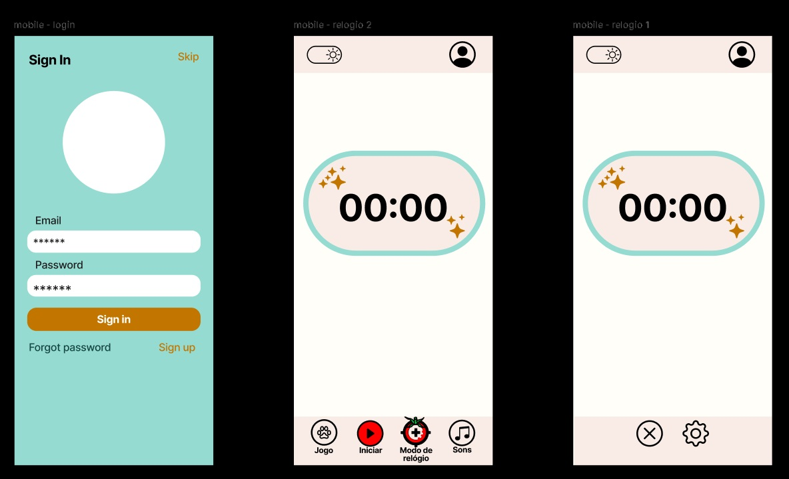
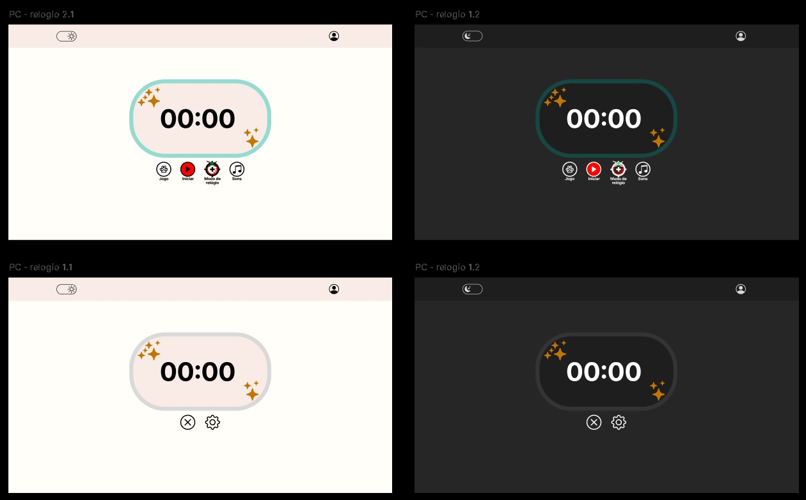

# Pomodoro app
Estudos de web com o desenvolvimento de uma aplicação de pomodoro. A inteção é criar um site que tenha um cronometro alternando com o que foi configurado para ele, como o estilo pomodoro

---
### Propostas:
- [ ] Em relação ao design buscar somente o necessário
- [ ] Responsivo (desktop e mobile)
- [ ] Modo claro e escuro

---

### Design inicial
Mobile:

Desktop:

