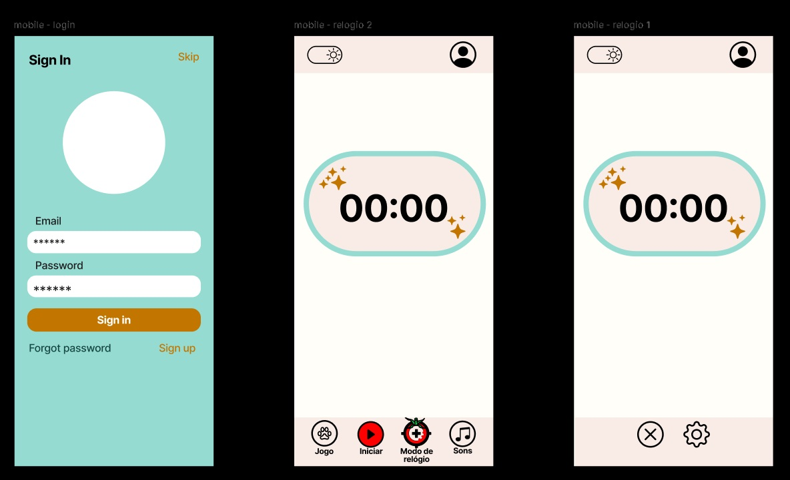
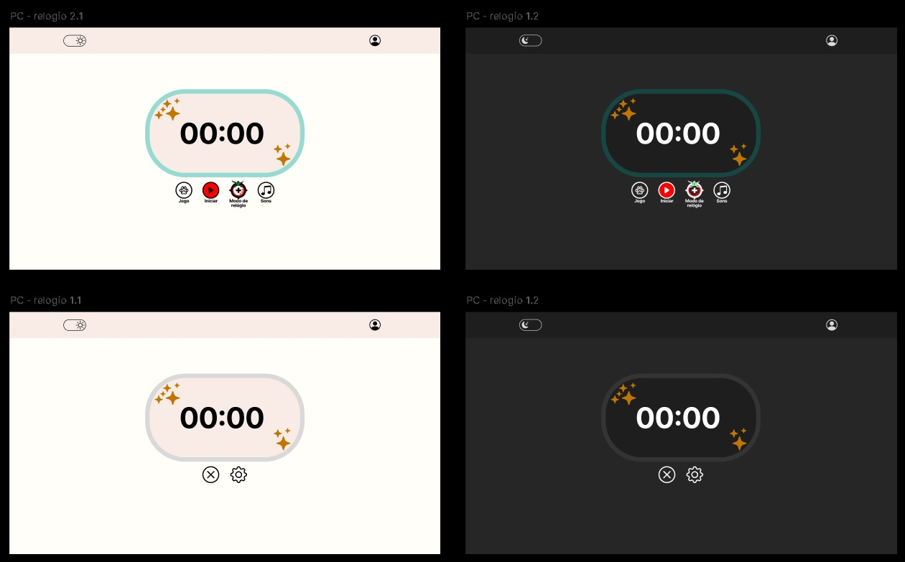

# Pomodoro app

Estudos de web com o desenvolvimento de uma aplicação de pomodoro. A inteção é criar um site que tenha um cronometro alternando com o que foi configurado para ele, como o estilo pomodoro

A pasta "design" serve apenas de auxílio para a documentação e demais informações.

---

## Propostas

- [ ] Em relação ao design: buscar botões auto explicativos
- [X] Modo claro e escuro
- [ ] Responsivo (desktop e mobile)

---

## Design inicial

Mobile:

Desktop:

